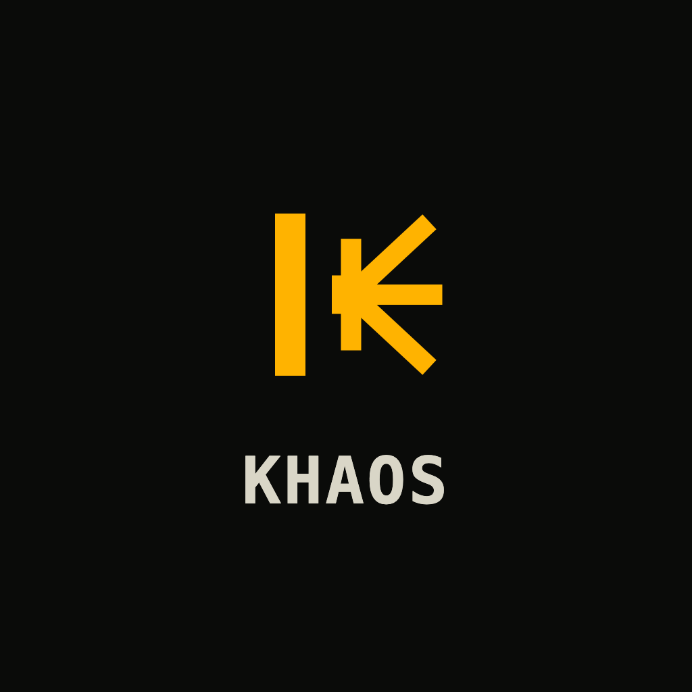

<div align="center">
  
  <h1>Khaos: Kafka Load Testing &amp; Chaos Engineering</h1>

  [](https://github.com/aleksandarskrbic/khaos/actions/workflows/ci.yml)
  [](https://pkg.go.dev/github.com/aleksandarskrbic/khaos)
  [](https://goreportcard.com/report/github.com/aleksandarskrbic/khaos)
  [](LICENSE)
</div>

<p align="center">
  
</p>

> Khaos is an open-source Kafka traffic generator, load-testing tool, and chaos engineering CLI
> for reproducing realistic Kafka workloads and failure scenarios (consumer lag, hot partitions,
> rebalances, and broker failures) on demand, instead of waiting for production to find them.

**[Documentation](https://getkhaos.dev/docs)** · **[Quick Start](https://getkhaos.dev/docs/quickstart)** · **[Scenario Reference](https://getkhaos.dev/docs/reference/scenario-file)**

## What it does

- **Generate realistic Kafka test data**: structured, faker-backed records in JSON, Avro, or Protobuf.
- **Simulate producer and consumer traffic**: configurable throughput, key distributions, and consumer group topology.
- **Load test Kafka clusters** and the applications that consume from them, including Kafka Streams and Flink jobs.
- **Reproduce failure conditions on purpose**: consumer lag, hot partitions, rebalances, and broker failures, scheduled on a timeline.

Scenarios are plain YAML. No code, no client library, no instrumentation in the system under test.

## Quick start

```bash
go install github.com/aleksandarskrbic/khaos/cmd/khaos@latest

khaos list                          # see the bundled scenarios
khaos run traffic/high-throughput   # auto-starts a local 3-broker Kafka cluster
```

`khaos run` manages its own local Kafka cluster via Docker Compose. To target a cluster you
already have, including managed clusters needing SASL/SSL, use `khaos simulate` instead. See the
[Quick Start guide](https://getkhaos.dev/docs/quickstart) and
[Installation](https://getkhaos.dev/docs/installation) for release binaries and Docker.

## A few scenarios

```bash
khaos run traffic/hot-partition       # skewed key distribution overloads one partition
khaos run traffic/consumer-lag        # producer rate outpaces slow consumers
khaos run chaos/broker-chaos          # brokers stop and restart while traffic keeps flowing
khaos run chaos/rebalance-storm       # a consumer group rebalances repeatedly
```

`khaos validate` checks a scenario file's structure without running it: the same command Khaos's
own CI runs against every bundled scenario. See the
[Scenarios](https://getkhaos.dev/docs/scenarios/consumer-lag) and
[Guides](https://getkhaos.dev/docs/guides/kafka-load-testing) sections of the docs for what
each one actually configures and why.

## Documentation

Full documentation, including the CLI reference, the scenario YAML schema, and guides for load
testing, data generation, and each failure scenario, lives at
**[getkhaos.dev/docs](https://getkhaos.dev/docs)**:

- [Kafka Load Testing](https://getkhaos.dev/docs/guides/kafka-load-testing)
- [Kafka Data Generation](https://getkhaos.dev/docs/guides/kafka-data-generation)
- [Consumer Lag Testing](https://getkhaos.dev/docs/guides/consumer-lag-testing)
- [CLI Reference](https://getkhaos.dev/docs/reference/cli)
- [Scenario File Reference](https://getkhaos.dev/docs/reference/scenario-file)

## Architecture

Khaos is a single Go binary. The scenario engine is independent of any user interface: it exposes
one read method, `Snapshot()`, and the terminal UI, the headless log loop, and the final summary
table all poll it. Nothing in the engine knows about terminals, so a headless run in CI behaves
identically to an interactive one, and a stalled UI can't stall a run.

Kafka access is [franz-go](https://github.com/twmb/franz-go), a pure-Go client, which is what makes
`CGO_ENABLED=0`, cross-compilation, `go install`, and a `distroless/static` image all work without
a C toolchain. See the [Concepts](https://getkhaos.dev/docs/concepts) page for the full picture.

## Rewritten in Go

Khaos was rewritten from Python to Go: a single static binary, no runtime dependencies, and a pure
Go Kafka client that cross-compiles cleanly. See the
[release notes](https://github.com/aleksandarskrbic/khaos/releases) for details.

## Contributing

Issues and pull requests are welcome. See [CONTRIBUTING.md](CONTRIBUTING.md). If Khaos is useful
to you, a star helps others find it.

## License

Apache 2.0. See [LICENSE](LICENSE).
