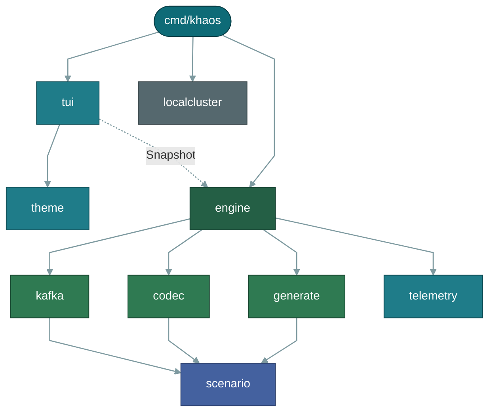
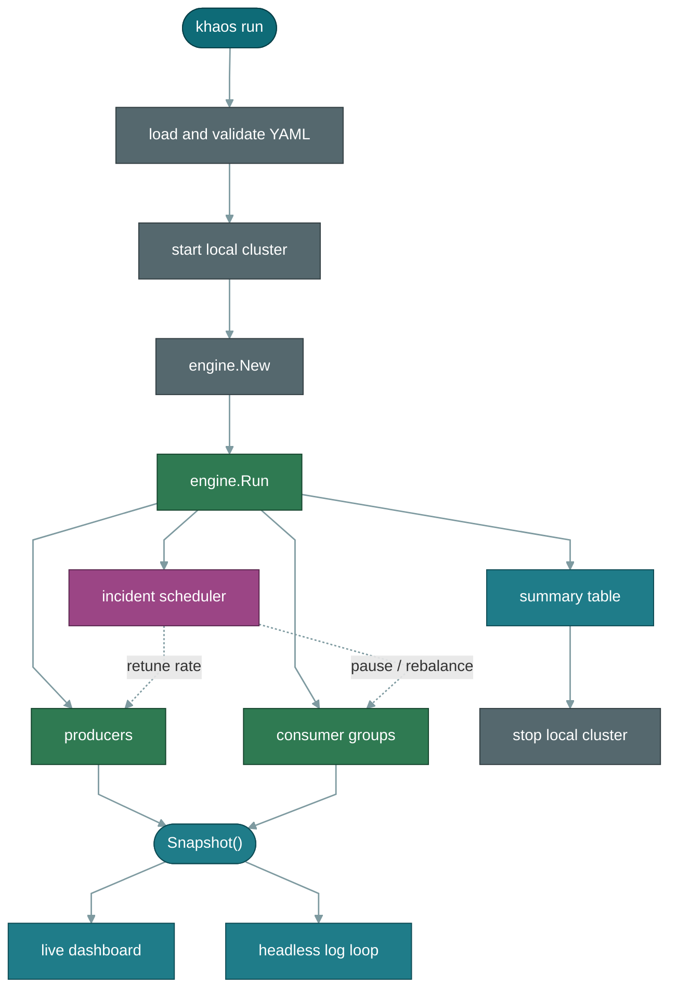

<div align="center">
  
  <h1>Khaos: Kafka Load Testing &amp; Chaos Engineering</h1>

  [](https://github.com/aleksandarskrbic/khaos/actions/workflows/ci.yml)
  [](https://pkg.go.dev/github.com/aleksandarskrbic/khaos)
  [](https://goreportcard.com/report/github.com/aleksandarskrbic/khaos)
  [](LICENSE)
</div>

<p align="center">
  
</p>

> Khaos is an open-source Kafka traffic generator, load-testing tool, and chaos engineering CLI
> for reproducing realistic Kafka workloads and failure scenarios (consumer lag, hot partitions,
> rebalances, and broker failures) on demand, instead of waiting for production to find them.

**[Documentation](https://getkhaos.dev/docs)** · **[Quick Start](https://getkhaos.dev/docs/quickstart)** · **[Scenario Reference](https://getkhaos.dev/docs/reference/scenario-file)**

## What it does

- **Generate realistic Kafka test data**: structured, faker-backed records in JSON, Avro
  or Protobuf.
- **Simulate producer and consumer traffic**: configurable throughput, key distributions
  and consumer group topology.
- **Load test Kafka clusters** and the applications that consume from them, including
  Kafka Streams and Flink jobs.
- **Reproduce failure conditions on purpose**: consumer lag, hot partitions, rebalances
  and broker failures, scheduled on a timeline.

Scenarios are plain YAML. No code, no client library, no instrumentation in the system
under test.

## Quick start

```bash
go install github.com/aleksandarskrbic/khaos/cmd/khaos@latest

khaos list                          # see the bundled scenarios
khaos run traffic/high-throughput   # auto-starts a local 3-broker Kafka cluster
```

`khaos run` starts the bundled three-broker cluster with Docker Compose if it is not already
up, and stops it again when the run ends -- pass `-k` to keep it. While it is up, Kafka UI is
on <http://localhost:8080>. `khaos cluster-up` and `khaos cluster-down` drive the same cluster
by hand.

To target a cluster you already have, including managed clusters needing SASL/SSL, use
`khaos simulate -b broker:9092` instead; it never touches Docker. See the
[Quick Start guide](https://getkhaos.dev/docs/quickstart) and
[Installation](https://getkhaos.dev/docs/installation) for release binaries and Docker.

## A few scenarios

```bash
khaos run traffic/hot-partition       # skewed key distribution overloads one partition
khaos run traffic/consumer-lag        # producer rate outpaces slow consumers
khaos run chaos/broker-chaos          # brokers stop and restart while traffic keeps flowing
khaos run chaos/rebalance-storm       # a consumer group rebalances repeatedly
```

`khaos validate path/to/scenario.yaml` checks a file's structure without running it, reporting
every problem it finds with a line number rather than stopping at the first. With no arguments
it checks every bundled scenario, which is what makes it usable as a CI gate. See the
[Scenarios](https://getkhaos.dev/docs/scenarios/consumer-lag) and
[Guides](https://getkhaos.dev/docs/guides/kafka-load-testing) sections of the docs for what
each one actually configures and why.

## Documentation

Full documentation, including the CLI reference, the scenario YAML schema, and guides for load
testing, data generation, and each failure scenario, lives at
**[getkhaos.dev/docs](https://getkhaos.dev/docs)**:

- [Kafka Load Testing](https://getkhaos.dev/docs/guides/kafka-load-testing)
- [Kafka Data Generation](https://getkhaos.dev/docs/guides/kafka-data-generation)
- [Consumer Lag Testing](https://getkhaos.dev/docs/guides/consumer-lag-testing)
- [CLI Reference](https://getkhaos.dev/docs/reference/cli)
- [Scenario File Reference](https://getkhaos.dev/docs/reference/scenario-file)

## Architecture

One Go module, one binary. `cmd/khaos` is the cobra CLI -- flags, wiring and the static
output -- and everything else lives under `internal/`, forming a one-way chain from a scenario
file to Kafka records.



Every node except `cmd/khaos` lives under `internal/`, and arrows point from importer to
imported. `cmd/khaos` actually imports every internal package except `generate`; only its three
structural edges are drawn, because eight lines leaving one node buries the shape the diagram
exists to show. The graph has no cycles and `scenario` is the sink: it imports nothing in the
repo and everything else speaks its vocabulary. The one edge that is not a plain import is
`tui -> engine`, drawn dotted because it is a read -- the dashboard polls `Snapshot()` and has no
other way to reach a run.

Colour is the layer: teal is the CLI and its output surfaces, green is the run itself and the
record pipeline feeding it, indigo is the shared vocabulary, slate is infrastructure.

### Packages

- **`internal/scenario`** -- the YAML domain model, decoding, validation, and the bundled
  scenario corpus embedded in the binary. It imports nothing else in the repo; everything that
  touches a scenario imports it.
- **`internal/generate`** -- builds values from a topic's `message_schema`: field values, whole
  documents, keys with a given distribution and cardinality, and correlated multi-step flow
  messages. Every generator takes an explicit `*rand.Rand` and none touch the global
  source, which is what lets `--seed` replay the same records.
- **`internal/codec`** -- encodes those documents as JSON, Avro or Protobuf, with the schema
  inline or fetched from Schema Registry, including the Confluent wire header.
- **`internal/kafka`** -- builds the [franz-go](https://github.com/twmb/franz-go) Kafka clients
  and runs the admin calls that prepare topics. Every deliberate departure from a franz-go
  default is collected in `policy.go`. No other package constructs a `kgo` client --
  `internal/engine` is handed the ones it uses -- and the only other franz-go client in the
  repo is the Schema Registry client in `internal/codec`.
- **`internal/engine`** -- the run itself: producers, consumer groups, per-producer rate
  limiting, the incident scheduler, and the counters behind `Snapshot()`.
- **`internal/tui`**, **`internal/telemetry`**, **`internal/theme`** -- output: the live
  terminal dashboard, the structured logger plus the Prometheus `/metrics` and `/healthz`
  server, and the colour palette the dashboard and the CLI's own tables share.
- **`internal/localcluster`** -- the bundled three-broker cluster, driven by the `docker` CLI
  against compose files embedded in the binary. It depends on nothing else in the repo, and
  `khaos simulate` never calls into it.

The engine is independent of any user interface. It exposes one read method, `Snapshot()`, and
the terminal UI, the headless log loop and the final summary table all poll it. Nothing in the
engine knows about terminals, so a headless run in CI behaves identically to an interactive one,
and a stalled UI cannot stall a run.

franz-go is a pure-Go Kafka client, which is what makes `CGO_ENABLED=0`, cross-compilation,
`go install` and a `distroless/static` image all work without a C toolchain.

### What a run does



`engine.New` is where topics are created, unless `--skip-topic-creation` says otherwise.
Incidents also stop and restart brokers, which is the one thing `khaos simulate` cannot do: it
runs the same path without the two cluster steps, and broker incidents become no-ops there
because Khaos cannot stop someone else's broker. Whether the dashboard or the log loop reads
`Snapshot()` is decided once at startup from whether stdout is a TTY; the summary table prints
from a final `Snapshot()` either way.

Slate is setup and teardown, green is traffic, magenta is the chaos, teal is everything that
reads a run rather than driving it.

**Where to start reading:** `cmd/khaos/run.go` for the flags and the wiring, then
`internal/engine/run.go` for what a run actually does. `internal/scenario/types.go` is the
vocabulary every other package speaks. The [Concepts](https://getkhaos.dev/docs/concepts) page
covers the same ground for users rather than contributors.

## Rewritten in Go

Khaos 0.8.0 replaced the Python implementation with this one: a single static binary with the
scenarios and compose files embedded, no virtualenv and no librdkafka. Commands, flags,
shorthands and the scenario YAML format carried over unchanged, so existing scenario files still
run. The PyPI package is gone: install a release binary, `go install`, `brew install khaos`,
or use the multi-arch image at `ghcr.io/aleksandarskrbic/khaos`. See
[CHANGELOG.md](CHANGELOG.md) and the
[release notes](https://github.com/aleksandarskrbic/khaos/releases).

## Contributing

Issues and pull requests are welcome. See [CONTRIBUTING.md](CONTRIBUTING.md). If Khaos is useful
to you, a star helps others find it.

## License

Apache 2.0. See [LICENSE](LICENSE).
